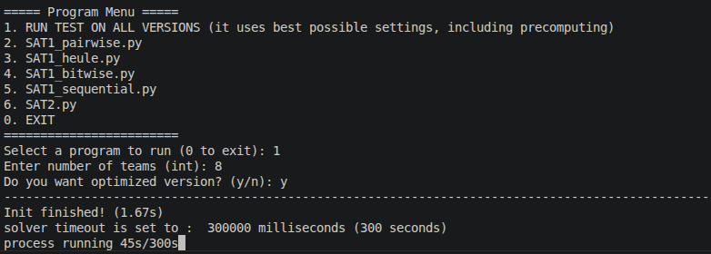
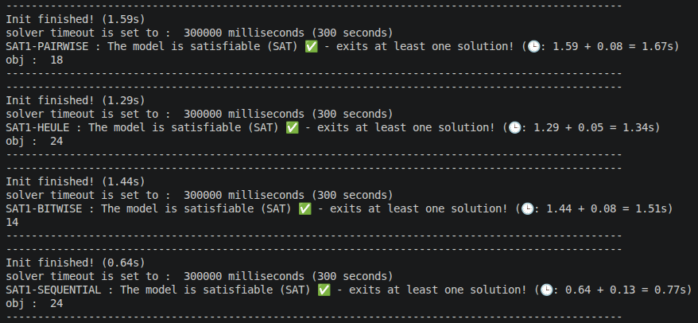

# Sports Tournament Scheduling (STS) Solver

Organizing sports tournaments is a strategically important, yet complex task. As sports continue to grow in commercial value and global popularity, the demand to efficiently generate equitable tournament schedules has become increasingly critical.

This repository provides an implementation for solving the Sports Tournament Scheduling (STS) problem, a challenging combinatorial decision and optimization problem.

## Features

- Generates feasible tournament schedules for a given set of teams.

- Ensures fairness and balance, avoiding scheduling conflicts and minimizing travel or idle rounds.

- Provides optimization strategies to improve schedule quality (e.g., minimizing breaks, balancing home/away games).

- Modular design to allow students and researchers to experiment with different algorithms (constraint programming, local search, metaheuristics, SAT/SMT solvers, etc.).
  
- Interactive command-line menu for easy execution and testing of different models and parameters.
  
<table>
  <tr>
    <td align="center" width="50%">
      
    </td>
    <td align="center" width="50%">
      
    </td>
  </tr>
</table>

## Technologies & Methods

- Python-based implementation (easy to extend and modify).

- Incorporates combinatorial optimization techniques.

- Implements multiple solving paradigms using differents tecnology:

  - SAT (Boolean Satisfiability) for logical constraint modeling.   (**Z3**)

  - MIP (Mixed-Integer Programming) for optimization under linear constraints. 

  - CP (Constraint Programming) for flexible scheduling constraints.  (**MINIZINC**)


## Use Cases

- Academic research in combinatorial optimization and AI.

- Practical applications in sports management systems.

- Teaching material for courses on optimization, scheduling, and operations research.

## Getting Started (Linux 🐧)


1. Start the Docker engine.
2. Move to `.../SportsTournamentScheduling-STS`
3. Open the **Bash Terminal** and Run the command:

   ```bash
   # Make the script executable
   chmod +x start.sh
   # Run the script
   bash start.sh
   ```
4. Use the script menu as you prefer.

   * Every **JSON solution generated** will be saved in the `res/<MODEL>` directory.
     * It is possible to test the correctness of the solution in linear time using [solution_checker.py](notes/solution_checker.py).
   * Each program appends its solution to the same file.
   * To reset, simply delete `solutions.json` file.

## Getting Started (Windows)


1. Start the Docker engine.
2. Move to `.../SportsTournamentScheduling-STS`
3. Open the **Powershell** and Run the command:

   ```bash
   docker build -t cmdo_img:latest .

   docker run --rm -it -v ${PWD}\res\SAT:/app/outputs/SAT -v ${PWD}\res\CP:/app/outputs/CP -v ${PWD}\res\MIP:/app/outputs/MIP cmdo_img 
   
   ```
4. Use the script menu as you prefer.

   * Every **JSON solution generated** will be saved in the `res/<MODEL>` directory.
      * It is possible to test the correctness of the solution in linear time using [solution_checker.py](notes/solution_checker.py).
   * Each program appends its solution to the same file.
   * To reset, simply delete `solutions.json` file.


###  Result

In the `/res` directory, you will find **key results** saved for specific values of n (e.g., n = 2, n = 6, n = 12).
For each model, the _highest value of n_ successfully reached is also recorded.
For example, if a model only shows _n = 12_ and no other values, it means that 12 is the maximum value it was able to achieve.

## Report

In order to generate the report (and clean up auxiliary files aftewards) make sure you have a [LaTeX distribution](https://www.latex-project.org/get/)
installed on your machine.
Then just run:
```sh
make report clean
```
which will output [`report.pdf`](./report.pdf).
